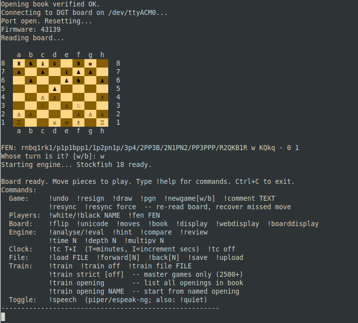
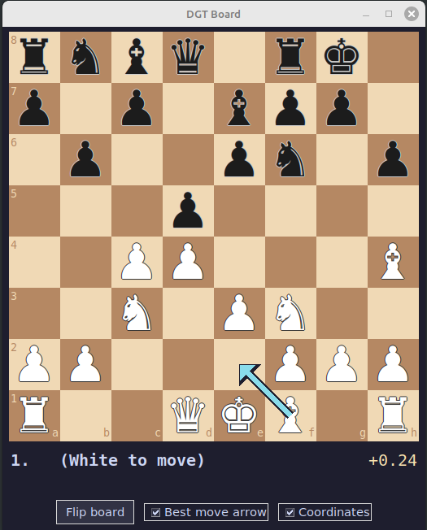
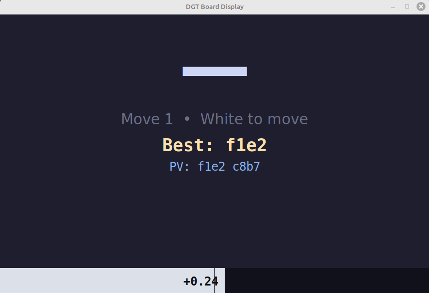
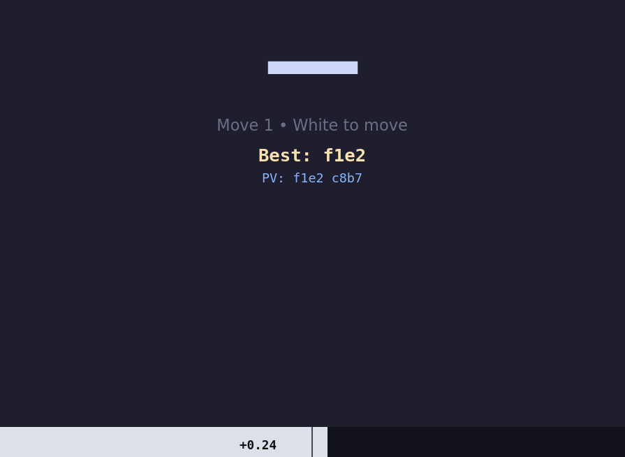

# DGT Smart Board - Ada Interface

Linux interface for the [DGT Smart Chess Board](https://www.digitalgametechnology.com/products/home-use-e-boards/smart-board-with-indices) written in Ada (GNAT 12).
Connects via USB CDC/ACM, tracks games, exports PGN, and integrates Stockfish analysis.



## Requirements

> **Platform:** Linux only. The serial port handling, process spawning, and shell
> integration rely on Linux-specific behaviour and have not been tested on macOS
> or Windows.

- GNAT (tested with GNAT 12.3.0)
- gprbuild
- A UCI-compatible chess engine -- `stockfish` is found automatically if it is on `PATH` (e.g. `sudo apt install stockfish`); any other engine can be configured with `engine=/path/to/engine` in `~/.chesslinkrc`
- `curl` - for Lichess opening book, tablebase and PGN upload
- `espeak-ng` or `espeak` - optional, for move announcements (basic robotic voice)
- `piper` + an ONNX voice model - optional, for high-quality neural TTS announcements (recommended over espeak)
- `aplay` (part of `alsa-utils`) - required when using piper
- `python3` with `tkinter` - optional, for the big-display window
- `python3` - optional, for the web display

## Build

```
make
```

Or directly with gprbuild:

```
gprbuild -P dgt_smartboard.gpr
```

Produces `bin/chesslink` (main application) and `bin/raw_dump` (raw protocol diagnostic tool).

Other make targets:

| Target                  | Effect                                          |
|-------------------------|-------------------------------------------------|
| `make`                  | Build everything (default)                      |
| `make clean`            | Remove all build artifacts                      |
| `make run`              | Build and run chesslink                         |
| `make run-raw`          | Build and run raw_dump (diagnostics)            |
| `make test`             | Build and run the test suite                    |
| `make compress-book`    | Encode `data/openings.dat` -> `data/openings.clkb` (~44% smaller) |
| `make decompress-book`  | Decode `data/openings.clkb` -> `data/openings.dat` |

## Tests

Run the self-contained test suite (no board required):

```
make test
```

Covers FEN parsing and round-trip, move application (UCI and SAN), castling
(including cannot-castle-through-check and cannot-castle-into-check), en
passant, promotion, checkmate and stalemate detection, pin geometry (pinned
piece cannot expose king), 50-move rule, threefold repetition, draw by
insufficient material (K+B vs K, K+N vs K), undo, the opening book, and the
CLKB compression library (UCI<->12-bit round-trip, packed-byte formula).  Exits
with a non-zero status if any test fails.

## Running

Connect the DGT Smart Board (default `/dev/ttyACM0`), then:

```
./bin/chesslink
```

To use a different device port, pass it as an argument:

```
./bin/chesslink /dev/ttyACM1
```

You may need to be in the `dialout` group to access the serial port:

```
sudo usermod -aG dialout $USER
```

## Configuration

Settings are saved to `~/.chesslinkrc` with `!save`. See
[`.chesslinkrc`](.chesslinkrc) in the repo root for a working example (copy
it to `~/.chesslinkrc` and adjust the paths/token). Supported keys:

| Key      | Default                   | Description                           |
|----------|---------------------------|---------------------------------------|
| device   | `/dev/ttyACM0`            | Serial device path for the DGT board  |
| engine   | `sf/stockfish-ubuntu-...` | Path to UCI engine binary (Stockfish, Leela, Komodo, ...) |
| openings | *(built-in ~400 entries)* | Path to opening book file             |
| openings_sha1 | *(not set)*          | SHA-1 of the opening book file (40-char hex). Set once; startup warns on mismatch. |
| lichess_token | *(not set)*          | Lichess API token for `!book` and opening trainer. Get one at lichess.org/account/oauth/token |
| time     | 1500                      | Analysis time in milliseconds         |
| depth    | 0                         | Analysis depth (0 = use time)         |
| multipv  | 1                         | Number of principal variations        |
| unicode  | 0                         | Use unicode piece symbols (1)         |
| speech    | 0           | Announce moves via TTS (1). Toggle with `!speech` during play.       |
| tts_model | *(not set)* | Path to piper ONNX voice model. If set, piper is used instead of espeak. Example: `~/.local/share/piper/en_US-lessac-medium.onnx` |

#### Verifying the opening book (`openings_sha1`)

The built-in ~400-entry book needs no setup. If you point `openings=` at your
own book file instead, `openings_sha1` lets chesslink detect if that file
was later corrupted or edited.

You don't need to run `sha1sum` by hand. The first time you start chesslink
with a custom `openings=` set and no `openings_sha1`, it computes the hash
and prints the line to add:

```
Warning: opening book loaded but SHA-1 not configured.
  Add to ~/.chesslinkrc:  openings_sha1=40ad6b70cd3bad7481b86c0ea41075c4dcbf72ae
```

Paste that line into `~/.chesslinkrc` (or run `!save` after setting it) and
future startups print `Opening book verified OK.` instead. If the file's
hash ever changes unexpectedly, you'll see a mismatch warning with both the
expected and actual hashes instead of chesslink silently trusting an altered
book.

## Commands

Type commands while a game is in progress:

### Game control

| Command          | Effect                                               |
|------------------|------------------------------------------------------|
| `!undo`          | Take back the last move                              |
| `!resign`        | Resign (active player loses)                         |
| `!draw`          | Agree to a draw                                      |
| `!pgn`           | Print current PGN to screen                          |
| `!newgame`       | New game, white to move (`!newgameb` for black)      |
| `!resync`        | Re-read the board, recover a missed move if possible |
| `!resync force`  | Re-read the board, adopt it as-is (breaks PGN continuity) |
| `!white NAME`    | Set White player name                                |
| `!black NAME`    | Set Black player name                                |
| `!comment TEXT`  | Add a comment to the last move in the PGN            |

#### Recovering from a missed move (`!resync`)

The board only ever reports lift/place events, so a dropped serial message
or a piece nudged during setup can leave the program's idea of the position
out of step with the physical board. `!resync` re-reads the board and
reconciles it against the current game state:

- If the board already matches, nothing changes (this also clears a stuck
  "piece lifted" state, which is handy on its own after a fumbled setup).
- If the board differs by exactly one legal move from where the game
  thinks it is, that move is applied automatically -history, PGN, and
  clocks stay correct, as if the move had been detected normally.
- If the difference can't be explained by a single legal move (more than
  one move happened while disconnected, or the pieces are simply wrong),
  `!resync` prints a square-by-square diff and refuses to guess. Fix the
  physical position and try again, or run `!resync force` to adopt the
  board as-is -this keeps the game playable but breaks PGN move-history
  continuity for the untracked change, so use it as a last resort.

### Board display

| Command      | Effect                                         |
|--------------|------------------------------------------------|
| `!flip`      | Flip board orientation                         |
| `!unicode`   | Toggle unicode / letter piece display          |
| `!moves`     | Print move list with current FEN               |
| `!fen FEN`   | Set up position from FEN string                |
| `!display`      | Open big-text window (Tk, readable at distance)  |
| `!webdisplay`   | Start web display server at localhost:8080       |
| `!boarddisplay` | Open graphical chess board window (Tk)           |

### Engine and analysis

| Command      | Effect                                                   |
|--------------|----------------------------------------------------------|
| `!analyse`   | Analyse current position (also: `!eval`)                 |
| `!hint`      | Show which piece Stockfish wants to move (not where)     |
| `!compare`   | Compare last played move to Stockfish's suggestion       |
| `!review`    | Review whole game: classify every move, show summary     |
| `!time N`    | Set analysis time to N milliseconds                      |
| `!depth N`   | Set analysis depth (0 = use time instead)                |
| `!multipv N` | Show N principal variations (1-5)                        |

If no engine is configured or it failed to start, these commands print
`No engine running -- set 'engine=/path/to/engine' in ~/.chesslinkrc and restart.`
instead of running.

### Opening book and tablebase

| Command  | Effect                                              |
|----------|-----------------------------------------------------|
| `!book`  | Query Lichess opening explorer for current position |

Tablebase is queried automatically when <= 7 pieces remain on the board.

### Time control

| Command    | Effect                                              |
|------------|-----------------------------------------------------|
| `!tc T+I`  | Enable time control: T minutes + I seconds increment|
| `!tc off`  | Disable time control                                |

### Opening trainer

| Command                 | Effect                                            |
|-------------------------|---------------------------------------------------|
| `!train`                | Start Lichess-based training from current position|
| `!train off`            | Stop training mode                                |
| `!train strict`         | Train against master games only (classical, 2500+)|
| `!train strict off`     | Back to all Lichess games (training stays on)     |
| `!train file FILE`      | Train against a PGN repertoire file               |
| `!train opening`        | Browse the opening book interactively             |
| `!train opening NAME`   | Set up named opening position and start training  |

`NAME` matches case-insensitively against the opening name, the ECO code
(e.g. `E94`), or a pasted `ECO  Name` line from the browser.

The interactive browser shows 20 openings per page: type a number to
select one, `n`/`p` to change page, any other text to filter the list,
or `q` to quit.

Training checks each move against the Lichess opening explorer and reports
whether it is a main line, a sideline, or out of book.

#### Strict mode

By default the explorer aggregates games from *all* rated Lichess players
at every time control, so common club-level moves count as "in book" even
when theory disapproves of them. `!train strict` restricts the query to
classical games played by 2500+ rated players, which effectively means
training against master-level theory only.

Typical usage:

```
!train strict
!train opening Kings Indian Defense
```

The strict flag survives opening selection, so the order above works -
you get the King's Indian position with master-only feedback. Turn the
filter off with `!train strict off` (training continues against the full
database) or end the session with `!train off` (which also resets strict).

Limitations to be aware of:

- The filtered database is far smaller. In sidelines or rare variations
  you will hit "no games in this position" -reported as out of book -
  many moves earlier than in normal mode. That is the filter working as
  intended, but it can be surprising in offbeat openings.
- Popularity still isn't correctness: the report reflects what strong
  players play, not engine evaluation. Use `!analyse` for the latter.
- Each move still costs one explorer API request; a Lichess token in
  `~/.chesslinkrc` (`lichess_token=`) helps avoid rate limiting.

### File and Lichess

| Command        | Effect                                           |
|----------------|--------------------------------------------------|
| `!save`        | Save current settings to `~/.chesslinkrc`              |
| `!upload`      | Upload current game to Lichess                   |
| `!load FILE`   | Load a PGN file for move-by-move navigation      |
| `!forward [N]` | Step N moves forward in loaded game (default 1)  |
| `!back [N]`    | Step N moves back in loaded game (default 1)     |

### Other

| Command   | Effect                                          |
|-----------|-------------------------------------------------|
| `!speech` | Toggle move announcements on/off (also: `!quiet`) |
| `!help`   | Print command summary                           |

## Speech announcements

Chesslink can announce moves aloud as they are played -e.g. *"bishop c four"*,
*"knight g one to f three"*, *"checkmate, white wins"*. Two TTS backends are
supported, in order of preference:

| Backend   | Quality   | Requirement                         |
|-----------|-----------|-------------------------------------|
| **piper** | Excellent -natural neural voice | piper binary + ONNX model file + aplay |
| **espeak-ng** / **espeak** | Robotic but always available | `sudo apt install espeak-ng` |

Toggle announcements at any time with `!speech` (or `!quiet`). Set `speech=1`
in `~/.chesslinkrc` to enable by default.

### Option 1 -espeak-ng (simple)

```
sudo apt install espeak-ng
```

Add to `~/.chesslinkrc`:

```
speech=1
```

### Option 2 -piper (recommended)

[Piper](https://github.com/rhasspy/piper) is an offline neural TTS engine that
produces natural-sounding speech.

**Step 1 -download the piper binary**

Go to the [piper releases page](https://github.com/rhasspy/piper/releases) and
download the Linux x86\_64 archive. Extract it and put the `piper` binary on
your `PATH`:

```bash
cd /tmp
wget https://github.com/rhasspy/piper/releases/download/2023.11.14-2/piper_linux_x86_64.tar.gz
tar -xzf piper_linux_x86_64.tar.gz
mkdir -p ~/prg/piper
cp piper/piper ~/prg/piper/
```

Add `~/prg/piper` to your `PATH` in `~/.bashrc`:

```bash
export PATH="$HOME/prg/piper:$PATH"
```

Then reload: `source ~/.bashrc`

**Step 2 -install aplay**

```
sudo apt install alsa-utils
```

**Step 3 -download a voice model**

Voice models are available on the [piper voices page](https://rhasspy.github.io/piper-samples/).
Download an `.onnx` file and its matching `.onnx.json` config file.
The `en_US-lessac-medium` voice is a good choice:

```bash
mkdir -p ~/.local/share/piper
cd ~/.local/share/piper
wget https://huggingface.co/rhasspy/piper-voices/resolve/main/en/en_US/lessac/medium/en_US-lessac-medium.onnx
wget https://huggingface.co/rhasspy/piper-voices/resolve/main/en/en_US/lessac/medium/en_US-lessac-medium.onnx.json
```

**Step 4 -configure chesslink**

Add to `~/.chesslinkrc`:

```
speech=1
tts_model=~/.local/share/piper/en_US-lessac-medium.onnx
```

**Test outside chesslink:**

```bash
echo "knight g one to f three" | piper -m ~/.local/share/piper/en_US-lessac-medium.onnx --output-raw | aplay -r 22050 -f S16_LE -t raw -
```

## Remote displays

Three optional display modes read the same status file (`/tmp/dgt_status.txt`)
written after every move and can all run at the same time alongside the terminal.

### Graphical board (`!boarddisplay`)

Launches `tools/dgt_board.py` as a Tk window showing a full graphical chess
board that updates after every move. Requires `python3` with `tkinter`.

```
!boarddisplay
```



Features:
- Board rendered with Unicode chess pieces; white pieces are solid white, black pieces solid dark
- Last move highlighted in yellow-green
- Best-move arrow drawn in cyan, toggled by a **Best move arrow** checkbox
- Eval score colour-coded (green = White better, red = Black better)
- Opening name shown below the board
- **Flip board** button in the window (also mirrors the `!flip` state automatically)
- **Coordinates** checkbox toggles file/rank labels drawn inside squares (Lichess style)
- Resizable window; piece size scales with the window

### Big-text window (`!display`)

Launches `tools/dgt_display.py` as a background Tk window. Requires `python3`
with `tkinter` (standard on most Linux distributions).

```
!display
```



The window shows the last move at very large size, eval bar at the bottom,
best move, and PV. It resizes freely and updates every 400 ms.

### Web display (`!webdisplay`)

Launches `tools/dgt_webdisplay.py` as a local HTTP server on port 8080.

```
!webdisplay
```

Open `http://localhost:8080/` in any browser. To view from a phone or tablet
on the same network, replace `localhost` with the machine's local IP address
(e.g. `http://192.168.1.x:8080/`). The page updates automatically every 400 ms
with no manual refresh needed.




### How the web display auto-update works

After every move the Ada program writes a small plain-text file
(`/tmp/dgt_status.txt`) containing key=value pairs: the last move, eval
score, best move, PV, whose turn it is, and so on.

The Python web server (`dgt_webdisplay.py`) listens on port 8080 and handles
two routes:

- `GET /` -- returns the self-contained HTML/CSS/JavaScript page.
- `GET /status.json` -- reads `/tmp/dgt_status.txt` on every request and
  returns its contents as a JSON object.

The HTML page contains a JavaScript loop (`setInterval`) that calls
`fetch('/status.json')` every 400 milliseconds. When the response arrives,
the JavaScript updates the DOM elements directly -- the move label, eval bar
width, score text, PV line, etc. -- without ever reloading the page. This is
called HTTP polling: the browser repeatedly asks the server "anything new?"
and repaints only what changed.

No WebSocket or server-push technology is needed; the plain `http.server`
module from the Python standard library is sufficient for a single local user.

All three tools can also be started directly from a terminal:

```
python3 tools/dgt_board.py
python3 tools/dgt_display.py
python3 tools/dgt_webdisplay.py [port]
```

## PGN output

Games are auto-saved after every move to two locations:

- `~/games/TIMESTAMP.pgn` - permanent per-game archive
- `~/games/live.pgn` - always contains the current game (useful for external GUIs)

## CLKB opening book compression

The opening book ships as a plain-text `.dat` file but can be compressed to a
binary `.clkb` file using the tools built into this project.  The format is
purpose-built for the opening book's structure and achieves ~44% size reduction
(368 KB -> 209 KB) with a trivial encoder and decoder.

### Why it compresses well

The `.dat` file stores one opening per line in the form:

```
e2e4 e7e5 g1f3 b8c6 f1b5|C65|Ruy Lopez: Berlin Defense
```

Two properties of this data drive the compression:

1. **Move text is verbose.** Each half-move is five characters (`"e2e4 "`).
   Most openings have 5-15 moves, so moves dominate the file.  A chess move
   needs only 12 bits (source square 6 bits + destination square 6 bits), so
   packing moves into binary immediately cuts move storage by ~70%.

2. **Adjacent lines share a move prefix.** The book is sorted by ECO code, so
   consecutive entries are often variations of the same opening.  Storing only
   the *new* moves relative to the previous entry avoids repeating the shared
   prefix.

### Binary format

```
Header (8 bytes)
  [0..3]  "CLKB"  magic
  [4..7]  entry count  (32-bit big-endian unsigned)

Per entry (variable length)
  [0]     shared   -- moves copied verbatim from the previous entry (0..255)
  [1]     new      -- moves that follow the shared prefix (0..255)
  [2..]   packed moves  -- 'new' 12-bit values packed in pairs (see below)
  [+0]    ECO letter  -- 'A'=0 .. 'E'=4  (1 byte)
  [+1]    ECO number  -- 0..99            (1 byte)
  [+2]    name length -- byte count of the name string (1 byte)
  [+3..]  name        -- raw ASCII
```

### 12-bit move encoding

A square is encoded as `file * 8 + rank` (file: `'a'`=0..`'h'`=7, rank:
`'1'`=0..`'8'`=7), giving values 0-63.  A move is `src_sq * 64 + dst_sq`,
fitting in 12 bits (0-4095).

Pairs of moves `M1`, `M2` are packed into 3 bytes:

```
byte 0 = M1 >> 4
byte 1 = (M1 & 0xF) << 4  |  M2 >> 8
byte 2 = M2 & 0xFF
```

An odd trailing move uses 2 bytes with the lower nibble of byte 1 set to zero.

### Tools

```
bin/clkb_encode [input.dat]  [output.clkb]   # compress
bin/clkb_decode [input.clkb] [output.dat]    # decompress
```

Or via make:

```
make compress-book
make decompress-book
```

## Protocol notes

The board speaks the DGT Smart Board serial protocol over USB CDC/ACM at 9600 8N1.
Use `bin/raw_dump` to inspect raw bytes for debugging or clock integration work.

> **Tested hardware:** This software has only been tested with the DGT Smart Board
> connected via USB. Other DGT boards (e-Board, Bluetooth) or connection methods
> have not been tried and may require adjustments.

## Features summary

- Full move validation: castling, en passant, promotion, check/pin geometry
- All draw conditions: 50-move rule, threefold repetition, stalemate, insufficient material
- Wrong-color move detection: only the active side can move
- SAN/PGN export with date, player names, move timings and engine eval comments
- Any UCI engine (Stockfish, Leela Chess Zero, Komodo, ...): time/depth control, multi-PV, eval bar, full PV line display
- Game review: per-move classification (best/inaccuracy/mistake/blunder) with summary
- Opening trainer: Lichess-based or file-based repertoire, named opening setup
- ~450-entry ECO opening book with longest-prefix matching
- Lichess opening explorer (!book), tablebase (auto, <= 7 pieces), PGN import (!upload)
- ANSI 256-color board with optional unicode chess symbols
- Big-text Tk window and auto-refreshing web display for phone/tablet viewing
- External GUI support via live.pgn
